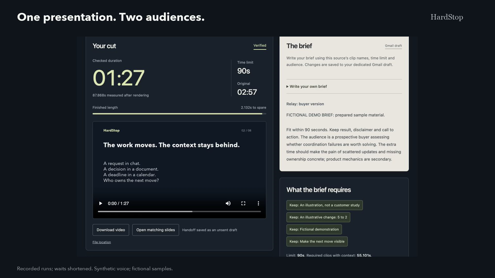

# HardStop

**One presentation. Two audiences. Both have 90 seconds.**

HardStop helps webinar and product-demo producers turn registered recordings into versions for different audiences and time limits. It reads the brief in Gmail, selects complete recordings from Dropbox, and creates a video with a matching Google Slides deck. It checks required clips, source order, actual runtime, and saved deliverables before preparing the handoff. When a request cannot fit, it explains why and keeps the last verified cut. [Read the producer use case and its evidence](docs/USE_CASE.md).

**[Watch the 1:50 demo](https://statsguysam.github.io/hardstop/)** | **[Inspect recorded results](https://statsguysam.github.io/hardstop/explore.html)**

[Download the recording](https://github.com/statsguysam/hardstop/releases/download/v0.3.0/hardstop-demo.mp4) | [Read the test evidence](docs/EVIDENCE.md)

The result inspector needs no account setup. It displays published run receipts, the actual selected videos and later provider readback checks. Choosing a case does not run the agent or change any app.

On the original recordings, a [custom 75-second Gmail brief](docs/evidence/custom-75.json) produced a verified 53.969-second delivery through the real apps. In a separate [controlled live test](docs/evidence/stale-brief.json), changing the real brief after the model responded stopped publication and preserved the previous delivery. Custom text is interpreted at runtime.



## Three apps, one delivery

| App | Input | Action and verification |
| --- | --- | --- |
| **Gmail** | A dedicated producer-brief draft, including amendments | Read the current requirements; create an unaddressed handoff draft with the verified output references. No email is sent. |
| **Dropbox** | Immutable prerecorded clips and their catalog | Download selected clips, verify their hashes and durations, upload the rendered MP4, then download it again and compare the bytes. |
| **Google Slides** | One source slide for each recorded segment | Copy the source presentation, retain the selected slides, then read back their content and order. The source deck remains intact. |

The runtime model is **`gpt-6-astra` through the OpenAI Responses API**, with a strict JSON schema. It extracts constraints with exact brief quotations, identifies unsupported requests, and scores optional clips for the audience and preferences. Python audits supported directive wording, enforces declared dependencies, and chooses the feasible set using those scores. FFmpeg renders it; FFprobe measures the actual output. The model does not execute tools or provide trusted timing estimates. Transcripts and content dependencies are supplied by the source owner.

## The same limit can need a different cut

Two completed live runs used the same **90-second cap**, mandatory result/disclaimer/call-to-action clips, and declared context dependency. A buyer brief produced **87.868 seconds**, with the problem explanation as the optional clip. An operator brief produced **88.368 seconds**, with the workflow explanation instead. Both delivered a video, matching copied Slides deck and unsent Gmail draft, with **25 checks passed**. The interface shows the model's concise explanation for optional choices and compares completed versions when their source catalog matches. [Current runs and limits](docs/EVIDENCE.md#current-release-runs).

A separate [predeclared six-case evaluation](docs/evidence/audience-evaluation.json) on the original Relay recordings passed **6/6 on six first API calls**: the audience pair, a supported paraphrase of each, an unsupported narration rewrite, and uncertain timing. Model priorities chose the expected optional clip in **4/4 audience cases**; using the source's fixed priorities with the same extracted hard constraints passed **2/4**. Total reported usage was **11,028 tokens**. This small authored evaluation demonstrates a specific model contribution; it is not a general accuracy estimate, customer validation, or proof of broad semantic understanding. It created no cloud deliverables.

A [separate Harbor holdout](docs/EVIDENCE.md#separate-harbor-holdout) checked another catalog at a new 65-second cap, including audience preferences, exclusion, impossibility, uncertain timing and rewriting. **6/6 responded model cases passed**, reporting **8,214 tokens**; fixed priorities passed 5/6. There were **12 client attempts across two batches**: six initial transport failures with unknown usage, followed by one fully documented operational rerun of all unchanged cases. All outcomes are retained. This extends the authored examples; it is not a blinded benchmark or general accuracy estimate.

These completed runs also show the work involved:

| Recorded delivery | End-to-end run time | Model time within that run | Reported model tokens |
| --- | ---: | ---: | ---: |
| [Buyer](docs/evidence/buyer-polished.json) | 60.215 seconds | 8.958 seconds | 1,824 |
| [Operator](docs/evidence/operator-polished.json) | 64.619 seconds | 9.718 seconds | 1,862 |
| [Harbor](docs/evidence/harbor-polished.json) | 54.018 seconds | 7.581 seconds | 1,371 |

Run time is the difference between the saved start and finish timestamps and includes app transfers, rendering and verification. These are three observations on this Mac and connection, not speed guarantees or measured user time savings. Initial source preparation, OAuth setup and human review are excluded; the successful operator call used substantial cached input. The demo shortens waiting time. An [earlier operator attempt](docs/evidence/operator-download-failure-polished.json) stopped during a Dropbox source download after 142.261 seconds and created no outputs; its 1,832 reported model tokens are separate from the successful-run table. The later run and failure are both retained. [Independent hypothetical review and remaining weaknesses](docs/REVIEW_ROUNDS.md).

## The demonstration

The source is **Relay**, a fictional product presentation with eight recordings and synthesized narration. Its measured source duration is **177.036 seconds**. The six-clip Harbor source measures **83.202 seconds**. All example outcomes are invented.

1. **Same time, different audience:** a buyer gets the problem explanation; an operator gets the workflow. Both versions retain the same mandatory content and fit within 90 seconds.
2. **Matching deliverables:** show the actual selected video, copied Slides deck and unaddressed Gmail handoff.
3. **Impossible revision:** a 30-second request cannot fit the 55.101 seconds of required clips and context. The operator delivery is preserved.
4. **Another source:** six different Harbor recordings produce a verified 44.701-second delivery after the brief is clarified. Both the initial review outcome and successful run are retained.

The demonstration measures **110.022 seconds**, within the two-minute limit. It uses the current stock-voice recordings and saved app outputs. [Media verification](docs/evidence/demo-recording-v3.json). The scenario buttons are conveniences for repeatable demonstrations; the public inspector displays recorded outcomes only.

The source catalog declares that `result` requires `pilot_context`. HardStop verifies that specific dependency and original ordering. It does not claim to discover every important nuance or prove general semantic preservation.

## Run locally

Run commands from the repository root; this prototype supports source checkouts. Use macOS or Linux with **Python 3.10+**, `ffmpeg` and `ffprobe` on `PATH`. The normal application uses the Python standard library. Use the prepared release bundles to avoid narration-generation dependencies. The original optional sample generator uses **macOS `say` and Pillow**. The current stock-voice generator has separate local model dependencies and [third-party notices](THIRD_PARTY_NOTICES.md); none are needed for ordinary imports or delivery.

```bash
python3 -m venv .venv
source .venv/bin/activate
python3 -m unittest discover -s tests -v
```

The current local suite passed **216 tests**, including FFmpeg media, loopback checks, and the recorded-result inspector; JavaScript syntax also passed. The [earlier v0.2.0 GitHub Linux CI](https://github.com/statsguysam/hardstop/actions/runs/34784957386) passed 213 tests on source commit `90654b7`, with no skipped tests. That remote result does not validate later source changes. A separate planner stress check matched an independent combinations-search oracle on **250 generated catalogs**; those cases are not included in the unit-test count. Tests do not need API credentials. They use controlled provider responses and local media fixtures; media tests are skipped when FFmpeg tools are unavailable. A passing unit suite is separate from a successful live API run.

For a fresh sample on macOS:

```bash
brew install ffmpeg
python3 -m pip install Pillow
python3 scripts/generate_demo_assets.py
```

This creates labeled recordings and a measured manifest under `.state/demo-assets/`. Generation uses the Mac's speech service. Existing generated recordings are reused only after catalog, hash, duration and decode verification.

**Original v0.2.0 sample bundle:** [Download hardstop-source.zip](https://github.com/statsguysam/hardstop/releases/download/v0.2.0/hardstop-source.zip). It contains the eight fictional recordings, optional slide cards and a portable manifest; it contains no credentials or cloud account IDs. Download it, compare its SHA-256 with the published release checksum, then import it on macOS or Linux:

```bash
python3 scripts/import_demo_assets.py /path/to/hardstop-source.zip
```

Import requires Python and FFmpeg, but no Pillow, `say` or API credentials. It checks the committed catalog, rejects unexpected archive paths and oversized content, verifies clip hashes, measured durations and full decoding, then installs `.state/demo-assets/`. It refuses to overwrite an existing source directory. Use `--output /path/to/new-source-directory` for a separate verification; `seed` uses the default `.state/demo-assets/` location. Fresh generation remains available through the macOS commands above.

### Configure your own API access

Live execution needs your own Google, Dropbox and OpenAI developer access. Connected chat plugins do not supply these standalone runtime credentials. The setup helper stores credentials locally with owner-only permissions under `.credentials/`, which is ignored by Git. Set `HARDSTOP_CREDENTIALS_DIR` before running commands if you use another private location.

**Google:** create a dedicated Cloud project; enable Gmail, Google Slides and Google Drive APIs. Configure the OAuth consent screen, add your own account as a test user if the app is in testing, and create a **Desktop app** OAuth client. Download its JSON and run:

```bash
python3 configure.py google-client /path/to/downloaded-desktop-client.json
python3 configure.py google
```

The requested scopes are `gmail.readonly`, `gmail.compose` and `drive.file`. Google consent technically allows sending under the compose scope; HardStop implements draft creation only. `drive.file` limits access to files authorized for the app, so `seed` creates its own source presentation instead of assuming access to an arbitrary existing deck. See [Google's OAuth setup guide](https://developers.google.com/workspace/guides/configure-oauth-consent).

**Dropbox:** create a scoped **App folder** application in the [Dropbox developer console](https://www.dropbox.com/developers/apps). Enable `files.content.read`, `files.content.write` and `files.metadata.read`, and register this exact redirect URI: `http://127.0.0.1:8765/dropbox/callback`. Then authorize using the public app key:

```bash
python3 configure.py dropbox --app-key YOUR_PUBLIC_APP_KEY
```

API paths are relative to that dedicated Dropbox app folder. The OAuth flow requests offline access so access tokens can refresh. It does not need Dropbox sharing permissions.

**OpenAI:** create an API key with Responses API access and available API credit. Enter the key at the hidden terminal prompt:

```bash
python3 configure.py openai-key --model gpt-6-astra
```

Do not paste credentials into the repository or chat. API requests use `store: false`; the local report records the response identity, model, usage and validated interpretation. See the [OpenAI API quickstart](https://developers.openai.com/api/docs/quickstart).

### Use your own recordings

Prepare **1 to 18 complete MP4 clips** and a JSON catalog with source-owner transcripts, titles, `slide_text`, declared dependencies and default values. IDs use 2 to 40 lowercase letters, digits or underscores, starting with a letter. The importer checks the files, measures and decodes them, then registers a dedicated Dropbox catalog, a source Slides deck generated from `slide_text`, and a Gmail brief draft. It does not transcribe the recordings or import an existing branded deck. [Source format, limits and a complete example](docs/SOURCE_GUIDE.md).

For the current examples, download the [Relay source package](https://github.com/statsguysam/hardstop/releases/download/v0.3.0/hardstop-relay-source.zip) or [Harbor source package](https://github.com/statsguysam/hardstop/releases/download/v0.3.0/hardstop-harbor-source.zip), compare its checksum, and extract it into a new directory. Each has `catalog.json`, `brief.txt` and complete recordings. Use the general `source` command below, not the legacy demo-bundle importer. [Bundle measurements and verification](docs/evidence/source-bundles-v3.json).

Use a new workspace for each source package, after configuring your API access:

```bash
python3 -m hardstop.cli --state-dir .state/my-presentation source /path/to/catalog.json \
  --brief /path/to/brief.txt --subject "Producer brief"
python3 -m hardstop.cli --state-dir .state/my-presentation run --id first-cut
python3 -m hardstop.cli --state-dir .state/my-presentation serve --port 8767
```

The `source` command creates dedicated resources in your three app accounts. Existing source workspaces are preserved. Open the local interface on port 8767, revise the Gmail brief through **Write your own brief**, and make the next cut. Imported workspaces do not offer the Relay demo presets. These recordings are copied and verified; no new narration is synthesized.

[Download the complete Harbor source package](https://github.com/statsguysam/hardstop/releases/download/v0.3.0/hardstop-harbor-source.zip), including its six recordings, catalog and authored briefs. Follow the [source guide](docs/SOURCE_GUIDE.md).

An independent six-clip fictional **Harbor** package completed this import-and-delivery path, producing a **44.701-second** cut against a 60-second brief with **24 checks passed**. Its first brief needed review because of an unsupported generic instruction; both that result and the clarified successful brief are retained. An independent post-run readback passed ten checks. This verifies a second prepared source, not adoption by an outside producer. [Current Harbor evidence](docs/EVIDENCE.md#current-release-runs).

### Seed and execute the fictional demo

The following commands create clearly labeled fictional demo artifacts in your three app accounts. They operate on those dedicated resources and never send email.

```bash
python3 -m hardstop.cli seed
python3 -m hardstop.cli brief original
python3 -m hardstop.cli run --id demo-120
python3 -m hardstop.cli brief amendment
python3 -m hardstop.cli run --id demo-90
python3 -m hardstop.cli brief impossible
python3 -m hardstop.cli run --id demo-30
python3 -m hardstop.cli status
python3 -m hardstop.cli serve --port 8766
```

Open [the local review interface](http://127.0.0.1:8766). Use **Write your own brief** to save an original brief to the dedicated Gmail draft; the runtime model reads that text on its next run. The interface shows run progress, requirements, optional-clip explanations, selected clips, verification checks and playable verified outputs. `brief ambiguous` exercises an unclear request. Use a new run ID for a new execution; calling an existing ID returns its saved report without repeating writes.

Run reports and media are saved under `.state/runs/<run-id>/`. Only a fully verified `ready` run updates `.state/latest_ready.json`. `infeasible`, `needs_review`, `stale`, `failed` and `unknown` outcomes preserve the prior reference. An interrupted or uncertain write requires reconciliation; changing the run ID is not a substitute for checking what the service already created.

## Reliability and evidence

- Grounded interpretation: strict response schema, known segment IDs, exact brief quotations and a scoped deterministic pattern audit of explicit clip directives and active timing clauses. Omitted recognized requirements, reversed polarity, and uncertain timing block the run.
- Deterministic planning: mandatory dependency closure, exclusions, original order and a separate selection verifier. Ambiguity blocks execution.
- Actual media checks: source hashes, measured durations, complete-clip rendering, full audio/video decode and a measured final deadline check.
- Cross-app verification: compare copied Slides content with the captured source before and after trimming, verify exact retained slide order, download the Dropbox upload for byte-for-byte comparison, and read back the unaddressed Gmail handoff draft.
- Change handling: source fingerprints and revisions are checked again throughout the run; stale inputs prevent promotion.
- Recorded write outcomes: local journals, unique artifact names and known resource IDs. Unknown writes are not blindly retried.

**Current live results:** the buyer and operator versions measure 87.868 and 88.368 seconds, each with 25 passed checks. Harbor measures 44.701 seconds with 24. The impossible 30-second revision created no outputs and preserved the operator delivery; later provider readbacks passed 10/12/10 checks. Both an earlier failed Dropbox download and Harbor wording that needed review are retained. A separate [source-registration interruption](docs/evidence/registration-recovery-v3.json) was reconciled from the saved pending path and matching file hash before setup continued. [Current receipts and conditions](docs/EVIDENCE.md#current-release-runs).

Earlier custom-brief, ambiguity and controlled stale-input results remain available in the [historical evidence](docs/EVIDENCE.md). Their original measurements and receipts have not been rewritten to match the regenerated source.

There is no distributed transaction across Gmail, Slides and Dropbox. A failed run can leave a private copied deck or uploaded file for reconciliation. Verification is point-in-time evidence; another person can change a cloud artifact after a run finishes. See [architecture and failure behavior](docs/ARCHITECTURE.md).

## Scope

This prototype selects complete prerecorded segments in source order, with one matching slide per segment. Source onboarding accepts a bounded package of 1 to 18 local MP4 recordings and declared metadata; it does not automatically split a long recording, transcribe speech, or import an arbitrary existing deck. Source labels, transcripts and dependencies are not independently authenticated. The scoped language audit can require review for unfamiliar wording, even when a person could resolve it. HardStop does not rewrite speech, change playback speed, cut inside clips, estimate a live speaker's delivery, or guarantee unrestricted semantic preservation. Deck checks compare structured content, not pixel-identical rendering. The original optional sample generator uses macOS speech; current source bundles do not require it. Windows is not a supported runtime because workflow locking uses `fcntl`.

The review server binds to loopback for local use. The public demo page and result inspector display saved recordings and receipts; they expose no live credentials or agent mutation endpoints.

[MIT license](LICENSE) | [Demo script](docs/DEMO_SCRIPT.md) | [Hackathon review](docs/HACKATHON_REVIEW.md) | [Submission checklist](docs/SUBMISSION_CHECKLIST.md)
