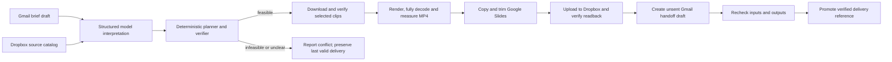

# Architecture

HardStop converts a changing producer brief into a verified cut of complete prerecorded segments and a corresponding copied slide deck. A runtime model interprets the request; explicit code controls selection, media operations and app writes.



## Components and boundaries

| Module | Responsibility |
| --- | --- |
| `configure.py` | Private credential storage, PKCE OAuth callback handling, access-token refresh and bounded HTTP requests. |
| `hardstop/providers.py` | Real Gmail, Slides/Drive and Dropbox API calls; draft readback, copied-deck verification, streamed media transfer, resource identity retention and safe provider errors. |
| `hardstop/interpret.py` | One OpenAI Responses API request with a strict JSON schema; validation of known IDs, exact evidence quotations, numeric duration support and explicit ambiguity. |
| `hardstop/source.py` | Validate a source-owner catalog, copy bounded local MP4 recordings without following links, measure and fully decode them, then install an immutable source package. |
| `hardstop/planner.py` | Pure deterministic subset selection, declared dependency closure, mandatory/excluded content, original order and independent selection checks. |
| `hardstop/media.py` | Probe and hash source files, fully decode inputs, concatenate normalized whole clips, verify output duration/audio/video and atomically install a new local artifact. |
| `hardstop/workflow.py` | Seed journal, run journal, app coordination, repeated source-freshness checks and promotion of the last verified delivery. |
| `hardstop/server.py` | Loopback review API and media serving; explicit routes, same-origin mutation checks and CSRF token validation. |
| `hardstop/cli.py` | Fictional seeding, independent source registration, brief changes, explicit run IDs, status and local server commands. |
| `scripts/evaluate_briefs.py` | Predeclare six interpretation cases, call the model once per case, score deterministic plans, and compare model priorities with a fixed-priority baseline. No cloud deliveries. |

## Source contract

There are two onboarding paths. `seed` uses the eight fictional segments in `fixtures/catalog.json`, with synthesized narration. `source` accepts 1–18 prepared local MP4 recordings and their source-owner catalog in a new workspace. Both register stable IDs, titles, transcripts, slide text, declared `requires` and default values. IDs contain 2–40 lowercase letters, digits or underscores and begin with a letter. Source import rejects generated slide-object name collisions. [Exact format and limits](SOURCE_GUIDE.md).

Source import measures duration from the files and verifies full decoding; it does not estimate timing from transcript length. It checks sizes, common dimensions, audio/video streams, safe relative paths and file hashes before installing a new source directory. It does not generate narration or verify that a user-declared transcript accurately describes the audio. The Relay fixture's `result` dependency on earlier `pilot_context` is one declared example, not a built-in dependency for every presentation.

Both onboarding paths generate a dedicated native Google Slides source deck from each clip's title and `slide_text`, upload the recordings and catalog to the configured Dropbox app folder, and create an unaddressed Gmail brief draft. An arbitrary existing deck is not imported. The local registration retains resource identities and fingerprints. A registered workspace refuses replacement with another source; use a separate `--state-dir`. Partial registration uses a journal and requires reconciliation when creation outcomes are unresolved or inputs change.

One source slide corresponds to one complete clip. Slide verification checks content and order against that registered mapping. It does not authenticate the source owner's labels, discover all semantic dependencies, or establish that media and slides are pixel-identical.

## Interpretation and planning

The model receives the brief and a bounded catalog containing IDs, titles, transcripts, declared prerequisites, measured durations and values. It receives no credentials or arbitrary tool interface. The current configured model is `gpt-6-astra`; requests use the Responses API, `store: false`, a strict schema and bounded output.

The returned structure includes duration, mandatory and excluded segment IDs, priorities, evidence quotations and ambiguities. The validator checks exact brief substrings and numeric duration evidence, rejects malformed or unknown IDs, and audits supported explicit directive grammar. Quotations help review constraints; they do not prove the model captured every human intention correctly. Optional-clip priority reasons are model-generated explanations, separate from verbatim evidence. The UI displays these reasons as text, labels in-progress choices as proposals, and only compares completed versions from the same known source catalog.

The planner accepts at most 18 segments and exhaustively considers subsets. It closes mandatory content over the declared prerequisite graph, preserves source order, honors exclusions and chooses a maximum-value feasible set. The model's priorities replace the catalog defaults for ranking; duration and source order break ties. A separate verifier recomputes the selected set's constraints. The model cannot bypass these checks by reporting a different duration or dependency graph.

This separation has an observed consequence: two 90-second audience briefs with identical required closure chose different optional clips. The buyer version selected the problem explanation and the operator version selected the workflow. The [six-case evaluation and separate full-app runs](EVIDENCE.md#live-audience-versions) distinguish model-dependent ranking from deterministic enforcement. The fixed-priority baseline reuses the model's extracted hard constraints, so it isolates ranking rather than representing an application with no model at all.

If a brief has unresolved ambiguity, the result is `needs_review`. If its mandatory dependency closure exceeds the budget or conflicts with exclusions, the result is `infeasible`. Neither outcome starts rendering or output creation.

## Render and delivery checks

For a feasible plan, the workflow downloads the selected Dropbox recordings and verifies their SHA-256 values and measured durations. FFmpeg fully decodes the inputs, retains complete clips in source order and renders an MP4. Audio normalization can add silence to a clip boundary; it does not rewrite, accelerate or truncate spoken content to satisfy the budget. FFprobe measures the result, and the workflow checks that actual duration against the brief.

The workflow checks the source fingerprint immediately before copying the Slides presentation. It compares the copy with the captured source content, removes unselected slides, and compares the retained slides and presentation-wide layouts, masters, page geometry, notes and styles again. Changes to the copied document title and documented volatile API fields are excluded from this comparison. It uploads the MP4 to a new run-specific Dropbox path, downloads the upload again and compares its SHA-256 with the local render. The handoff is an unaddressed Gmail draft containing the measured timing, selected IDs and artifact references. Dropbox's temporary download link expires; the stored app-folder path and revision remain in the receipt.

Input fingerprints and revisions are rechecked before and after consequential stages. The source brief includes recipient state in its fingerprint; addressed demo briefs are rejected. Output deck and video revisions are checked before a successful run is promoted.

## Journaling, retries and partial outcomes

The application saves each stage and known output identity under `.state/runs/<run-id>/report.json`. State writes use a temporary file plus atomic local replacement. A filesystem lock prevents overlapping workflow operations. Brief amendments use a separate lock so a new amendment can be detected as stale during a run.

| Outcome | Meaning | Last valid delivery |
| --- | --- | --- |
| `ready` | All required checks passed at the recorded verification time. | Updated to this run. |
| `infeasible` | The explicit content and timing constraints cannot all hold. | Preserved. |
| `needs_review` | The brief contains unresolved uncertainty or unsupported instructions. | Preserved. |
| `stale` | A checked source changed while the run was in progress. | Preserved. |
| `failed` | A known error or failed verification stopped the run. | Preserved. |
| `unknown` | A write may have occurred, or a run was interrupted before its final outcome was recorded. | Preserved; reconcile before retrying. |

An existing run ID returns its saved report instead of repeating remote writes. If that saved report was still `running`, the next explicit lookup marks it `unknown`. The provider preserves a known created deck or draft identity when a later operation fails. This supports inspection and reconciliation; it is not a promise of exactly-once remote execution.

There is no atomic commit or automatic rollback across the three services. A blocked later stage may leave a private copied presentation, uploaded file or draft. Those artifacts remain unpromoted and are visible through the recorded run identity. Do not delete the state journal or choose a new ID to bypass an unresolved write; first inspect the known resource and outcome.

Only a `ready` result updates `.state/latest_ready.json`. That reference points to a previously verified set of deliverables; the source deck and earlier outputs are not overwritten by a new cut. Verification is point-in-time. Concurrent changes after the final check are outside the guarantee.

## Local review surface

The review server binds to `127.0.0.1`. It serves an explicit list of UI files, state and verified-run media routes. Mutations require the correct Host, same Origin and per-server CSRF token. Media paths are constrained to known run IDs; generic filesystem serving is not available. Credentials are kept in the private configuration directory and are not included in UI responses.

The review interface runs locally for one builder. The public demo page plays a labeled recording and exposes no live credentials or mutation endpoints.

## Verification and limits

Run the local suite without API credentials:

```bash
python3 -m unittest discover -s tests -v
```

The suite separates deterministic planning and interpretation checks, controlled provider failures and actual local FFmpeg operations. FFmpeg-dependent tests skip when the binaries are missing. Live evidence must come from full application runs with real app readbacks; connection tests and mocked provider tests alone are insufficient.

The published Relay demonstration is fictional and uses synthesized narration. Imported recordings may be different; their fictional-content and narration labels are source-owner declarations. The implementation verifies explicit requirements and declared dependencies for whole-clip edits. It does not infer a universal account of meaning, support arbitrary timelines, or promise that a person presenting live will finish on time.
